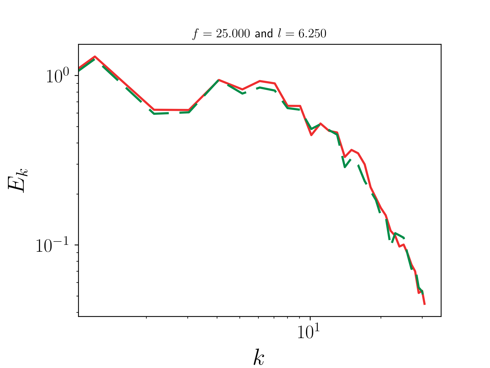

# Deep image prior for computational fluid dynamics

This work used deep image priors for CFD flow inpainting.

| Original |  Masked | Reconstructed | Energy spectra comparison|
:---------:|:-------:|:-------------:|:-------------------------:
  |  |   |  
  |  |   |  

Note: each `u`, `v`, `w` velocity is encoded as a RGB channel for these images.

## Notebooks and python environments

An illustrative Jupyter notebook, `demo.ipynb`, is provided in this repository. The quickest way to setup the Python environment is to use `pipenv install` and then `pipenv shell`.

## Reproducibility

Reproducing the turbulence results from the paper entails the following steps:

1. Generating the images from raw turbulence data: `$ python gen_turbulence_images.py -r 64`

1. Generating the image masks: `$ python gen_turbulence_masks.py -r 64`

1. Running the inpainting script: `$ python inpainting.py --use_gpu -r 64 -i 2001`

1. Running the interpolator script with standard GP: `$ mpirun -np 4 python interpolator.py -k gp -r turbulence/results`

1. Post-processing the results: `$ mpirun -np 4 python analysis_turbulence.py -p`

1. Generating the plots: `$ python plotter_turbulence.py`

For the flow around a cylinder:

1. Generating the images from raw flow data: `$ python gen_cylinder_images.py -r 512`

1. Running the inpainting script: `$ python inpainting.py --flow cylinder --use_gpu -r 512 -i 2001`

1. Running the interpolator script with standard GP: `$ mpirun -np 4 python interpolator.py -k gp -r cylinder/results`

1. Post-processing the results: `$ mpirun -np 4 python analysis_cylinder.py -p`

## Citation for this work
```
@article{HenrydeFrahan19,
    author    = {Henry de Frahan, M. T. and Grout, R.},
    title     = {Data recovery in computational fluid dynamics through deep image priors},
    journal   = {arXiv:1901.11113},
    year      = {2019}
}
```

## Background

This is work relies on code published and presented here:
```
@article{UlyanovVL17,
    author    = {Ulyanov, Dmitry and Vedaldi, Andrea and Lempitsky, Victor},
    title     = {Deep Image Prior},
    journal   = {arXiv:1711.10925},
    year      = {2017}
}
```

The code that is used here from the deep image prior work can be found in the folder `deep_image_prior`.
